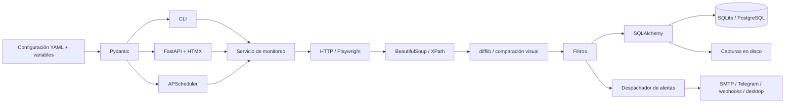

# Arquitectura

WebChangeSentinel separa configuración, captura, comparación, persistencia, alertas y presentación. La CLI y el dashboard utilizan el mismo servicio de monitoreo; el planificador invoca ese servicio con los monitores habilitados.

## Responsabilidades

| Componente | Responsabilidad |
| --- | --- |
| Configuración | Cargar YAML, resolver variables y validar monitores/canales. |
| Captura | Obtener contenido mediante HTTP o navegador; aplicar timeout, proxy, user agent y reintentos. |
| Extracción | Limpiar HTML, seleccionar el contenido y normalizar texto. |
| Detección | Comparar capturas y producir hash, porcentaje y diff. |
| Filtros | Decidir si el cambio detectado merece una alerta. |
| Persistencia | Guardar monitores, estado, snapshots, eventos y entregas. |
| Notificaciones | Traducir el evento a cada canal y aislar fallos de entrega. |
| Planificación | Ejecutar comprobaciones periódicas según el intervalo de cada monitor. |
| CLI/dashboard | Presentar estado, historial y administración mediante el mismo servicio. |

## Flujo de una comprobación

1. Se obtiene el monitor y se adquiere el límite de concurrencia.
2. Se descarga la página o se renderiza con Playwright. Se reintentan los fallos de captura con backoff exponencial.
3. Se limpian y seleccionan el HTML/texto. Se genera una captura visual si está activada.
4. Se obtiene la última captura correcta compatible con la configuración del monitor. Sin una captura previa compatible, se establece la base.
5. Se compara el contenido y se evalúan las reglas de filtro.
6. Se guarda la captura. Los cambios detectados se guardan con el diff y su resultado de filtrado.
7. Cuando corresponde una alerta, se intenta cada canal y se registra cada resultado.
8. Se actualiza el estado del monitor. Un error de descarga conserva la captura anterior.

Las operaciones de captura y envío son externas a la base de datos. No existe una transacción distribuida entre la base y los canales: si un proceso se interrumpe durante la entrega, no se garantiza una semántica de entrega exactamente una vez.

## Datos e historial

Los snapshots conservan HTML limpio, texto, hash, momento de captura y referencia al screenshot cuando existe. Los eventos representan diferencias entre capturas e incluyen el diff textual y si los filtros habilitaron la alerta. Las entregas registran éxito o fallo por canal.

Se guarda cada captura exitosa, aunque su contenido sea idéntico. Un cambio pequeño o descartado por keywords también actualiza la base; el historial permite revisar esas capturas sin que hayan producido una alerta. Los monitores eliminados se archivan y conservan sus snapshots y eventos.

Los snapshots incluyen una huella de la configuración de captura. Si cambian la URL, selector, tipo, motor, modos visuales o selectores ignorados, se establece una base compatible sin borrar el historial.

Las capturas visuales están en `snapshot_dir`, fuera de la base. Un backup completo necesita la base, la configuración y ese directorio. No hay borrado automático ni política de retención incorporada.

## Dashboard y API

La interfaz sirve HTMX desde los recursos locales del paquete y no necesita un CDN. Permite crear, editar, activar, pausar y eliminar monitores, ejecutar comprobaciones manuales y revisar diffs/capturas. Los canales se configuran por YAML y variables de entorno.

| Ruta | Uso |
| --- | --- |
| `GET /` | Dashboard y resumen de monitores. |
| `GET /monitors/{id}` | Configuración, snapshots y eventos del monitor. |
| `GET /health` | Estado del servicio HTTP. |
| `GET /docs` | Documentación OpenAPI interactiva. |
| `GET /api/monitors` | Listar monitores. |
| `POST /api/monitors` | Crear un monitor. |
| `PUT /api/monitors/{id}` | Actualizar un monitor. |
| `DELETE /api/monitors/{id}` | Archivar/eliminar el monitor de la configuración. |
| `POST /api/monitors/{id}/check` | Ejecutar una comprobación. |
| `GET /api/monitors/{id}/history?limit=50` | Consultar snapshots y eventos. |
| `GET /snapshots/{snapshot_id}/image` | Obtener una captura PNG almacenada. |

Utiliza el esquema de `/docs` para los cuerpos JSON y formatos de respuesta. El endpoint `/health` comprueba que el servidor responde; no confirma que un sitio remoto o un canal de alertas esté disponible.

## Ejecución y límites de concurrencia

APScheduler se ejecuta dentro del proceso. `run` inicia únicamente el planificador y `serve` añade el servidor FastAPI. Se utiliza un solo proceso y un solo worker. Varias réplicas no coordinan entre sí los jobs ni las alertas.

El límite `concurrency` evita iniciar demasiadas capturas al mismo tiempo. El renderizado con Chromium consume más memoria que HTTP; una frecuencia corta para muchos monitores puede saturar la máquina. Ajusta frecuencia, selectores y concurrencia usando tiempos y fallos observados.

SMTP y las notificaciones de escritorio se realizan fuera del hilo de eventos para que no bloqueen las tareas asíncronas. Los errores de un canal se convierten en resultados de entrega y no cancelan los demás.

## Extensión

Para añadir un motor, conserva el contrato de captura y permite que la detección reciba el mismo contenido normalizado. Para añadir un canal, incorpora su esquema de configuración, adaptador de envío y tests con transporte simulado. Los cambios de extracción y detección deben probarse con HTML controlado, sin depender de la disponibilidad de páginas públicas.

## Acceso y confianza

El dashboard no implementa usuarios ni autenticación. Un operador puede configurar URLs que apunten a Internet o a redes internas y puede añadir destinos de alertas. El sistema está diseñado para operadores de confianza; si se expone a una red compartida, el proxy debe autenticar a esos operadores. No es un servicio público para aceptar URLs arbitrarias de usuarios anónimos.
